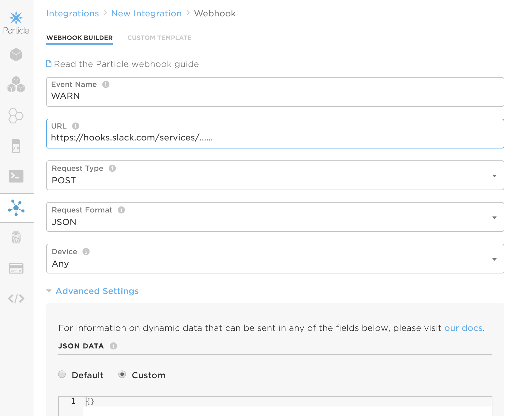

# Server setup and configuration

## Alerts to Slack with webhooks

### Naming

The particle device names for this scheme cannot excede 21 characters, and should take the form of `Name_Location_Equipmenttype`. For example, the device Bob monitoring an ultralow freezer in OML 321 should be named `Bob_OML321_Ultralow`.

### Create a Slack App

You need a slack app to send alerts to. Ours is a simple one which is just a collection of incoming webhooks. Each one points to a different channel in Slack. You can view/modify the list of them here: https://api.slack.com/apps/ASN0ZQSU8/incoming-webhooks?

### Create outgoing webhooks in Particle Console

For each of the `.json` files in this directory you need to create an outgoing webhook that will talk to Slack. Decide which channel each kind of alert should go to, then use the appropriate URL. Fill out the form here:

- Event Name should be one of `ALARM`, `CLEAR`, `INFO`, `WARN`
- URL is the incoming webhook URL from the Slack App
- Change Request Format to JSON
- Under advanced Settings chose the JSON DATA Custom button and paste in the eponymous json